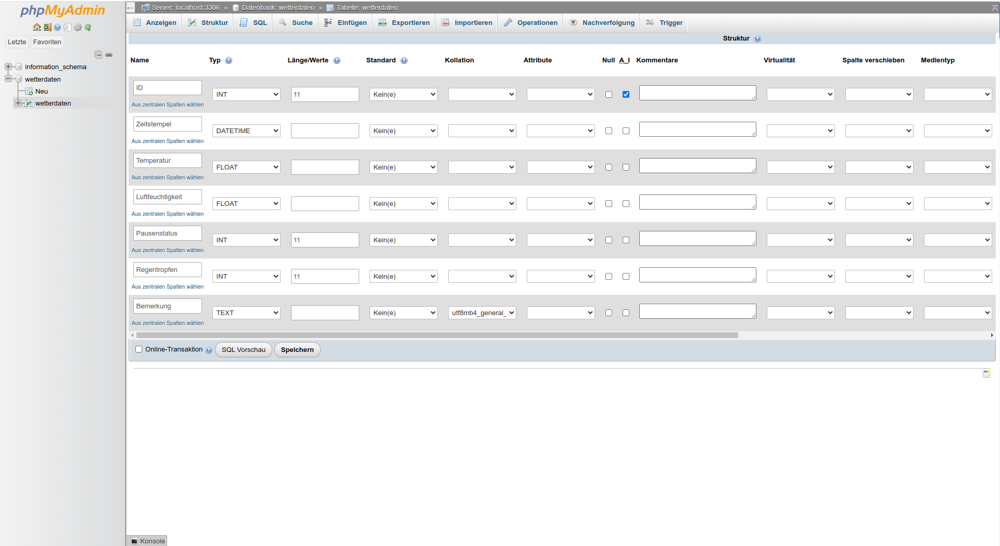
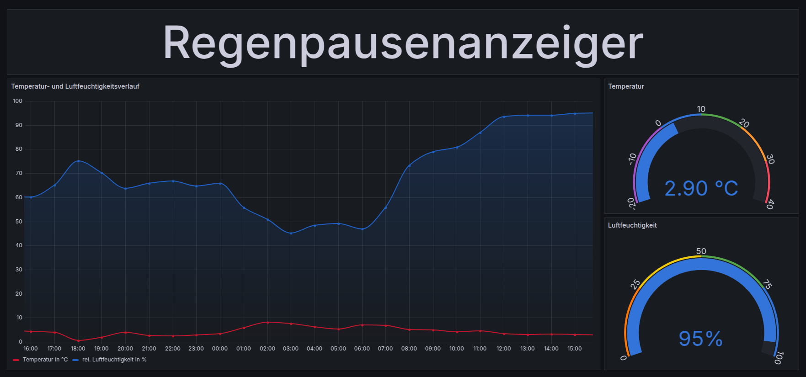

# Einrichtung der Anzeigestation des Regenpausenanzeigers

Diese Anleitung beschreibt die Installation und Konfiguration der Anzeigestation des Regenpausenanzeigers. Sie umfasst die Einrichtung eines LAMP-Servers (Linux, Apache, MariaDB, PHP), die Installation von phpMyAdmin und Grafana, sowie die Konfiguration für den automatischen Start und die Anzeige der Wetterdaten.
Dazu wird ein Computer mit Debian als Betriebssystem mit XFCE als Oberfläche vorrausgesetzt.
Hinweis: Diese Anleitung wurde mit Debian 12 und XFCE 4.18 getestet.


## 1. Installation der Basispakete

Nach dem ersten Start des Systems installiere die folgenden Pakete:

```bash
sudo apt install htop apt-xapian-index net-tools
```


## 2. Optionale Zwei-Faktor-Authentifizierung (2FA) einrichten

Für Benutzer kann zusätzlich eine 2FA für erhöhte Sicherheit eingerichtet werden.
Dazu muss folgendes Paket installiert werden: libpam-google-authenticator
```bash
sudo apt install libpam-google-authenticator
```

Danach als normaler Benutzer einrichten:
```bash
google-authenticator
```
Anschließend müssen weitere Einstellungen vorgenommen werden.
Öffne dazu die Datei `/etc/pam.d/common-auth`:
```bash
sudo nano /etc/pam.d/common-auth
```
Sie sollte wie folgt angepasst werden:
```
#
# /etc/pam.d/common-auth - authentication settings common to all services
#
# This file is included from other service-specific PAM config files,
# and should contain a list of the authentication modules that define
# the central authentication scheme for use on the system
# (e.g., /etc/shadow, LDAP, Kerberos, etc.).  The default is to use the
# traditional Unix authentication mechanisms.
#
# As of pam 1.0.1-6, this file is managed by pam-auth-update by default.
# To take advantage of this, it is recommended that you configure any
# local modules either before or after the default block, and use
# pam-auth-update to manage selection of other modules.  See
# pam-auth-update(8) for details.

# here are the per-package modules (the "Primary" block)
# Hinweis: forward_pass sorgt dafür, dass man den Verification-Code direkt hinter das Passwort schreiben kann.
auth    required                        pam_google_authenticator.so forward_pass
auth	[success=1 default=ignore]	pam_unix.so nullok
# here's the fallback if no module succeeds
auth	requisite			pam_deny.so
# prime the stack with a positive return value if there isn't one already;
# this avoids us returning an error just because nothing sets a success code
# since the modules above will each just jump around
auth	required			pam_permit.so
# and here are more per-package modules (the "Additional" block)
# end of pam-auth-update config
```


## 3. VNC-Einrichtung

Installiere die notwendigen Pakete:
```bash
sudo apt install tigervnc-standalone-server tigervnc-common tigervnc-tools tigervnc-xorg-extension
```

### 3.1. VNC für neue Session

1.  **Anpassung des `xstartup`-Skripts:**
    Öffne die Datei `~/.vnc/xstartup`:
    ```bash
    nano ~/.vnc/xstartup
    ```

    Stelle sicher, dass der Inhalt wie folgt aussieht (ggf. anpassen):
    ```bash
    #!/bin/bash
    unset SESSION_MANAGER
    unset DBUS_SESSION_BUS_ADDRESS
    exec /usr/bin/startxfce4
    ```

    Mache das Skript ausführbar:
    ```bash
    chmod +x ~/.vnc/xstartup
    ```

2.  **VNC-Passwort festlegen (für den Benutzer, nicht root!):**
    ```bash
    vncpasswd
    ```


### 3.2 VNC für Shared Session (aktuellen Desktop teilen und fernsteuern)

1. Konfiguration:
Erstelle oder bearbeite die Datei /etc/X11/xorg.conf.d/10-tigervnc.conf:
```bash
sudo nano /etc/X11/xorg.conf.d/10-tigervnc.conf
```

Füge Folgendes ein:
```
Section "Module"
    Load "vnc"
EndSection

Section "Screen"
    Identifier "Screen0"
    Option "passwordFile" "/etc/vncpasswd"
    Option "localhost" "yes" #sorgt dafuer, dass es nicht von aussen erreichbar ist
EndSection
```

2. Systemweites VNC-Passwort setzen:
```bash
sudo vncpasswd /etc/vncpasswd
sudo chmod 600 /etc/vncpasswd
```

3. Neustart
```bash
sudo reboot
```


### 3.3 VNC-Zugriff auf Regenpausenanzeiger über SSH-Tunnel für verschlüsselte Übertragung

**Shared Session (Bildschirm teilen):**

1.  **SSH-Tunnel auf dem *lokalen* Rechner erstellen:**
    ```bash
    ssh -L 5900:localhost:5900 user@regenpausenanzeiger
    ```

2.  **Mit VNC-Viewer verbinden:**
    Verwende einen VNC-Viewer auf dem lokalen Rechner (z.B. TigerVNC Viewer) und verbinde dich mit `localhost:5900`.

**Neue Session:**

1.  **VNC-Server auf dem *Regenpausenanzeiger* starten:**
    Dazu muss man sich zunächst über ssh einloggen und den folgenden Befehl ausführen:
    ```bash
    tigervncserver :1 -geometry 1920x1080 -localhost -xstartup ~/.vnc/xstartup
    ```

2.  **SSH-Tunnel auf dem *lokalen* Rechner erstellen:**
    ```bash
    ssh -L 5901:localhost:5901 user@regenpausenanzeiger
    ```

3.  **Mit VNC-Viewer verbinden:**
    Verwende einen VNC-Viewer auf dem lokalen Rechner (z.B. TigerVNC Viewer) und verbinde dich mit `localhost:5901`.


## 4. LAMP-Server einrichten

### 4.1 MariaDB installieren

```bash
sudo apt install mariadb-server
```


### 4.2 MySQL/MariaDB absichern

Führe das Skript zur Absicherung aus:

```bash
sudo mysql_secure_installation
```

Beantworte die Fragen wie folgt (wähle sichere Passwörter!):

*   Enter current password for root (enter for none): **(Enter drücken, falls kein Passwort gesetzt)**
*   Switch to unix\_socket authentication \[Y/n] **Y**
*   Change the root password? \[Y/n] **Y**
*   Remove anonymous users? \[Y/n] **Y**
*   Disallow root login remotely? \[Y/n] **Y**
*   Remove test database and access to it? \[Y/n] **Y**
*   Reload privilege tables now? \[Y/n] **Y**


### 4.3 PHP und Erweiterungen installieren

```bash
sudo apt install php php-mysql libapache2-mod-php php-cli
```

### 4.4 Apache neu starten

```bash
sudo systemctl restart apache2
```


### 4.5 Datenbank und Benutzer erstellen

1.  **Mit der MariaDB-Konsole verbinden:**
    ```bash
    sudo mysql -u root -p
    ```

2.  **Datenbank erstellen:**
    ```sql
    CREATE DATABASE wetterdaten;
    ```

3.  **Hauptbenutzer erstellen und Rechte vergeben (ersetze 'sicheres_passwort'!):**
    ```sql
    CREATE USER 'wetteruser'@'localhost' IDENTIFIED BY 'sicheres_passwort';
    GRANT ALL PRIVILEGES ON wetterdaten.* TO 'wetteruser'@'localhost';
    FLUSH PRIVILEGES;
    ```

4.  **Benutzer für Grafana (nur Lesezugriff) erstellen (ersetze 'sicheresPasswort2'!):**
    ```sql
    CREATE USER 'grafanauser'@'localhost' IDENTIFIED BY 'sicheresPasswort2';
    GRANT SELECT ON wetterdaten.* TO 'grafanauser'@'localhost';
    FLUSH PRIVILEGES;
    EXIT;
    ```


### 4.6 Tabelle für Wetterdaten erstellen
```bash
sudo mysql -u wetteruser -p wetterdaten
```


### 4.7 phpMyAdmin installieren
```bash
sudo apt install phpmyadmin
```

Bearbeite die Datei /etc/phpmyadmin/apache.conf, um den Zugriff nur vom lokalen Server zu erlauben:
```bash
sudo nano /etc/phpmyadmin/apache.conf
```

Für mehr Sicherheit kann der Zugriff auf phpMyAdmin von außen beschränkt werden, indem man nur lokalen Zugriff gewährt. Um trotzdem noch von anderen Computern darauf zugreifen zu können, kann man sich über einen SSH-Tunnel sicher verbinden und den Port weiterleiten.

Füge dazu folgende Zeilen hinzu, um den Zugriff nur von localhost zu erlauben:
```
<IfModule mod_authz_core.c>
    # Restrict access to localhost
    Require local
</IfModule>
```

Die komplette Datei (etc/phpmyadmin/apache.conf) sollte folgendermaßen aussehen:
```
# phpMyAdmin default Apache configuration

Alias /phpmyadmin /usr/share/phpmyadmin

<Directory /usr/share/phpmyadmin>
    Options SymLinksIfOwnerMatch
    DirectoryIndex index.php

    # limit libapache2-mod-php to files and directories necessary by pma
    <IfModule mod_php7.c>
        php_admin_value upload_tmp_dir /var/lib/phpmyadmin/tmp
        php_admin_value open_basedir /usr/share/phpmyadmin/:/usr/share/doc/phpmyadmin/:/etc/phpmyadmin/:/var/lib/phpmyadmin/:/usr/share/php/:/usr/share/javascript/
    </IfModule>

    # PHP 8+
    <IfModule mod_php.c>
        php_admin_value upload_tmp_dir /var/lib/phpmyadmin/tmp
        php_admin_value open_basedir /usr/share/phpmyadmin/:/usr/share/doc/phpmyadmin/:/etc/phpmyadmin/:/var/lib/phpmyadmin/:/usr/share/php/:/usr/share/javascript/
    </IfModule>

    # Zugriff auf localhost beschraenken:
    <IfModule mod_authz_core.c>
        # Restrict access to localhost
        Require local
    </IfModule>
</Directory>

# Disallow web access to directories that don't need it
<Directory /usr/share/phpmyadmin/templates>
    Require all denied
</Directory>
<Directory /usr/share/phpmyadmin/libraries>
    Require all denied
</Directory>
```

Anschließend muss Apache neu gestartet werden, sodass die Änderungen wirksam werden:
```bash
sudo systemctl restart apache2
```
Jetzt ist phpMyAdmin nicht mehr von außen erreichbar. Man kann entweder mit <http://localhost:8888/phpmyadmin/index.php> im Browserfenster vom Regenpausenanzeiger auf phpMyAdmin zugreifen oder mit einem SSH-Tunnel, indem man folgendes an einem anderen Rechner lokalen Rechner eingibt:

```bash
ssh -L 8888:localhost:80 user@regenpausenanzeiger
```

Dann kann man am lokalen Rechner folgendes im Browser eingeben, um auf phpMyAdmin zuzugreifen:
```
http://localhost:8888/phpmyadmin
```

Anschließend kann man mit phpMyAdmin die SQL-Datenbank genauer konfigurieren, wie im Bild gezeigt:


Es werden insgesamt sieben Spalten benötigt:
1.  **ID:**
    Eine ID, die automatisch hochgezählt wird

2.  **Zeitstempel:**
    Für die Speicherung der Zeit: Wann die Wetterdaten von der Dachstation erfasst wurden.

3.  **Temperatur**

4.  **Luftfeuchtigkeit**

5.  **Pausenstatus:**
    Der Pausenstatus wird jedes Mal von der Sekretariatsstation mit übermittelt. Damit kann dann im Grafana-Dashboard entschieden werden, welcher Pausenmodus angezeigt werden soll. Im [Beispiel-Dashboard](Grafana/Wetterdaten.json) wird damit die Überschrift "Regenpausenanzeiger" während einer Pause entsprechend geändert.

6.  **Regentropfen:**
    Anzahl der Regentropfen

7.  **Bemerkung:**
    In dieser Zeile kann man evtl. mit phpMyAdmin manuell eine Bemerkung hinzufügen. Diese wird von der Sekretariatsstation nicht beeinflusst.


### 4.8 PHP-Skript zum Empfangen der Wetterdaten erstellen

Die Wetterdaten werden mithilfe eines PHP-Skripts in die Datenbank eingetragen.
Erstelle dafür die Datei `/var/www/html/rcvwetterdaten.php`:

```bash
sudo nano /var/www/html/rcvwetterdaten.php
```

Füge den folgenden Code ein (und **ersetze `'sicheres Passwort'` durch das tatsächliche Passwort des `wetteruser`!**):

```php
<?php
/*
// PHP-Fehler anzeigen für Debugging
ini_set('display_errors', 1);
ini_set('display_startup_errors', 1);
error_reporting(E_ALL);
*/

// Verbindungsparameter für die SQL-Datenbank
$servername = "localhost";
$username = "wetteruser";
$password = "sicheres Passwort"; // Falls Anfuehrungszeichen im Passwort enthalten sind, kann man ein Backslash vor das Zeichen setzen. Ein Backslash selbst muss mit einem Backslash escaped werden.
$dbname = "wetterdaten";
$datenGespeichert = "Daten erfolgreich gespeichert.";

// Verbindung zur Datenbank herstellen
$conn = new mysqli($servername, $username, $password, $dbname);

// Verbindung überprüfen
if ($conn->connect_error) {
    die("Verbindung zur Datenbank fehlgeschlagen: " . $conn->connect_error);
}

// Überprüfen des Hostnamens anhand der IP-Adresse des ESP32, dass nicht jeder einfach Wetterdaten im Netzwerk an die Anzeigestation senden kann und sie in die Datenbank eingetragen weden
$hostname = 'RPAsekretariat.local';  // Hostname der Sekretariatstation
$client_ip = $_SERVER['REMOTE_ADDR'];
$hostname_ip = gethostbyname($hostname);

// Überprüfen, ob die Anfrage von Sekretariatstation kommt
if ($client_ip === $hostname_ip) {

    // Überprüfen, ob Daten übergeben wurden
    if ($_SERVER["REQUEST_METHOD"] == "GET" && isset($_GET['datum']) && isset($_GET['uhrzeit']) && isset($_GET['temperatur']) && isset($_GET['luftfeuchtigkeit']) && isset($_GET['pausenstatus']) && isset($_GET['regentropfen'])) {

        // GET Daten entgegennehmen
        $datum = $_GET["datum"];
        $uhrzeit = $_GET["uhrzeit"];
        $temperatur = $_GET["temperatur"];
        $luftfeuchtigkeit = $_GET["luftfeuchtigkeit"];
        $pausenstatus = $_GET["pausenstatus"];
        $regentropfen = $_GET["regentropfen"];
        $bemerkung = isset($_GET["bemerkung"]) ? $_GET["bemerkung"] : '';

        // Datum und Uhrzeit zu einem DATETIME-Format zusammenführen
        $datetime_obj = DateTime::createFromFormat('Y-m-d H:i:s', "$datum $uhrzeit");
        if ($datetime_obj) {
            $datetime = $datetime_obj->format('Y-m-d H:i:s');

            // SQL-Statement vorbereiten
            $sql = "INSERT INTO wetterdaten (zeitstempel, temperatur, luftfeuchtigkeit, pausenstatus, regentropfen, bemerkung)
                    VALUES ('$datetime', '$temperatur', '$luftfeuchtigkeit', '$pausenstatus', '$regentropfen', '$bemerkung')";

            if ($conn->query($sql) === TRUE) {
                echo $datenGespeichert;
            } else {
                echo "Fehler beim Speichern der Daten: " . $conn->error;
            }
        } else {
            echo "Ungültiges Datum oder Uhrzeit!";
        }
    } else {
        echo "Daten nicht im richtigen Format gesendet!!!";
    }
} else {
    // Wenn der Hostname nicht übereinstimmt, Fehlermeldung ausgeben
    echo "Zugriff verweigert.";
}

// Verbindung schließen
$conn->close();
?>
```

Setze die korrekten Berechtigungen und starte Apache neu:

```bash
sudo chown www-www-data /var/www/html/rcvwetterdaten.php
sudo chmod 640 /var/www/html/rcvwetterdaten.php
sudo systemctl restart apache2
```


## 5. Grafana installieren und konfigurieren
Für die Visualisierung der Wetterdaten wird [Grafana](https://grafana.com/) verwendet. Um das Grafana-Dashboard anzuzeigen wird Firefox benötigt. Das sollte bereits vorinstalliert sein.

**Installation von Grafana:**
Eine genaue Anleitung zur Installation von Grafana befindet sich [hier](https://grafana.com/docs/grafana/latest/setup-grafana/installation/debian/).

1.  **Voraussetzungen installieren:**
    ```bash
    sudo apt install apt-transport-https software-properties-common wget
    ```

2.  **GPG-Schlüssel importieren:**
    ```bash
    sudo mkdir -p /etc/apt/keyrings/
    wget -q -O - https://apt.grafana.com/gpg.key | gpg --dearmor | sudo tee /etc/apt/keyrings/grafana.gpg > /dev/null
    ```

3.  **Repository hinzufügen (für stabile Versionen):**
    ```bash
    echo "deb [signed-by=/etc/apt/keyrings/grafana.gpg] https://apt.grafana.com stable main" | sudo tee -a /etc/apt/sources.list.d/grafana.list
    ```

4.  **Paketlisten aktualisieren:**
    ```bash
    sudo apt update
    ```

5.  **Grafana installieren:**
    ```bash
    sudo apt install grafana
    ```

**Grafana konfigurieren:**

*   **Anonymen Zugriff auf Dashboards aktivieren:**
    Wenn das Wetterdashboard für jeden im Netzwerk ohne Anmeldung verfügbar sein soll, muss man dies explizit erlauben:
    ```bash
    sudo nano /etc/grafana/grafana.ini
    ```

    Suche den Abschnitt `[auth.anonymous]` und ändere die Zeile `;enabled = false` wie folgt:
    ```ini
    enabled = true
    ```

*   **Grafana beim Systemstart starten:**
    ```bash
    sudo systemctl enable grafana-server.service
    ```
    (Zum Neustarten: `sudo systemctl restart grafana-server`)

*   **Erstanmeldung bei Grafana:**
    *   Öffne im Browser: `http://localhost:3000`
    *   Standard-Login: Benutzername `admin`, Passwort `admin`.
    *   *   Du wirst aufgefordert, das Passwort zu ändern.


Um Einstellungen in Grafana sicher vorzunehmen (da nur http verwendet wird), kann der Port von Grafana per SSH-Tunnel weitergeleitet werden:
```bash
ssh -L 3000:localhost:3000 user@regenpausenanzeiger
```
Dann kann man lokal im Browser mittels <http://localhost:3000/> auf Grafana zugreifen.


**Grafana-Dashboard erstellen:**

Eine detaillierte Anleitung zur Erstellung von Grafana-Dashboards findest du in der offiziellen Grafana-Dokumentation:

*   [Dashboards](https://grafana.com/docs/grafana/latest/dashboards/)
*   [Panels und Visualisierungen](https://grafana.com/docs/grafana/latest/panels-visualizations/)

Schritte für die Erstellung eines Dashboards:
1.  Melde dich bei Grafana an.
2.  Klicke auf das  Plus-Symbol ("+", oben rechts) und wähle "Neues Dashboard".
3.  Klicke dann auf den Button "Visualisierung hinzufügen"
4.  Danach muss eine Datenquelle hinzufügt weden. In diesem Fall: MySQL
5.  Gib die Verbindungsdaten für die Datenquelle an:
    *   **Host URL:**  `localhost:3306`
    *   **Database name:** `wetterdaten`
    *   **Database:** `wetterdaten`
    *   **Username (haben wir vorher angelegt):** `grafanauser`
    *   **Password:**  Das Passwort des `grafanauser`.
6.  Klicke auf "Save & Test". Eine Erfolgsmeldung sollte erscheinen.

Anschließend kann man sein eigenes Dashboard erstellen. Es können ebenfalls Dashboards importiert werden. Ein Beispiel-Dashboard für den Regenpausenanzeiger befindet [hier](Grafana/Wetterdaten.json).
Dieses Beispiel-Dashboard zeigt die aktuellen Wetterdaten, sowie den Verlauf der letzten 24 Stunden an. Wenn gerade eine Pause ist, dann ändert sich die Überschrift "Regenpausenanzeiger" zur entsprechenden Pause.




## 6. Zugriff über `regenpausenanzeiger.local` im lokalen Netzwerk

Um das Grafana-Dashboard im lokalen Netzwerk unter dem Namen `regenpausenanzeiger.local` verfügbar zu machen, wird eine eine Weiterleitung erstellt:

1.  **Alte `index.html` umbenennen:**
    ```bash
    cd /var/www/html/
    sudo mv index.html old_index.html
    ```

2.  **Neue `index.html` mit Weiterleitung erstellen:**
    ```bash
    sudo nano /var/www/html/index.html
    ```

    Füge folgenden Inhalt ein (passe die URL ggf. an, wenn du ein anderes Dashboard oder einen anderen Port verwendest):
    ```html
    <!DOCTYPE html PUBLIC "-//W3C//DTD XHTML 1.0 Transitional//EN" "http://www.w3.org/TR/xhtml1/DTD/xhtml1-transitional.dtd">
    <html xmlns="http://www.w3.org/1999/xhtml">
      <head>
        <meta http-equiv="Content-Type" content="text/html; charset=UTF-8" />
        <meta http-equiv="refresh" content="0; url=http://regenpausenanzeiger.local:3000/d/adzzbfrw8vapsa/wetterdaten?orgId=1&from=now-24h&to=now&refresh=1m&kiosk" />
      </head>
    </html>
    ```
     * Erläuterung:
        *   `http-equiv="refresh" ...`: Leitet den Browser automatisch weiter.
        *   `url=...`: Die URL des Grafana-Dashboards.
            *   `regenpausenanzeiger.local`: Der Hostname der Anzeigestation.
            *   `:3000`: Der Standardport von Grafana.
            *   `/d/adzzbfrw8vapsa/wetterdaten`: Der eindeutige Bezeichner des Dashboards (kann in der URL des Dashboards im Dashboard-Editor gefunden werden).
            *   `?orgId=1`: Die Organisations-ID (normalerweise 1).
            *    `&from=now-24h&to=now`: Zeigt die Daten der letzten 24 Stunden an.
            *   `&refresh=1m`: Aktualisiert das Dashboard jede Minute.
            *   `&kiosk`: Startet das Dashboard im Kiosk-Modus (ohne Menüs).


## 7. Automatischer Login und Autostart
Damit das Grafana-Dashboard nach dem Einschalten automatisch angezeigt wird, muss ein Benutzer einrichtet werden, der sich ohne Passwort mit Autologin automatisch anmeldet und das Grafana-Dashboard in Firefox im Kioskmodus startet. 


### 7.1 Benutzer `wetterdisplay` erstellen

Erstelle einen Benutzer `wetterdisplay` und setze irgendein Passwort:
```bash
sudo adduser wetterdisplay
```

Passe /etc/pam.d/common-auth an:
```bash
sudo nano /etc/pam.d/common-auth
```

Füge folgende Zeile *vor* `auth    required     pam_google_authenticator.so forward_pass` ein:
```
auth    [success=3 default=ignore]      pam_succeed_if.so user = wetterdisplay
```

Die Datei sollte nun so aussehen:
```
#
# /etc/pam.d/common-auth - authentication settings common to all services
#
# This file is included from other service-specific PAM config files,
# and should contain a list of the authentication modules that define
# the central authentication scheme for use on the system
# (e.g., /etc/shadow, LDAP, Kerberos, etc.).  The default is to use the
# traditional Unix authentication mechanisms.
#
# As of pam 1.0.1-6, this file is managed by pam-auth-update by default.
# To take advantage of this, it is recommended that you configure any
# local modules either before or after the default block, and use
# pam-auth-update to manage selection of other modules.  See
# pam-auth-update(8) for details.

# here are the per-package modules (the "Primary" block)
# Benuter Wetterdisplay soll ohne Passwort und 2FA funktionieren
auth [success=3 default=ignore] pam_succeed_if.so user = wetterdisplay
# Hinweis: forward_pass sorgt dafür, dass man den Verification-Code direkt hinter das Passwort schreiben kann.
auth    required                        pam_google_authenticator.so forward_pass

auth	[success=1 default=ignore]	pam_unix.so nullok
# here's the fallback if no module succeeds
auth	requisite			pam_deny.so
# prime the stack with a positive return value if there isn't one already;
# this avoids us returning an error just because nothing sets a success code
# since the modules above will each just jump around
auth	required			pam_permit.so
# and here are more per-package modules (the "Additional" block)
# end of pam-auth-update config
```


### 7.2 `wetterdisplay` von SSH ausschließen
Der Benutzer `wetterdisplay` darf aus Sicherheitsgründen kein SSH benutzen!

Füge am Ende von `/etc/ssh/sshd_config` Folgendes hinzu:
```bash
sudo nano /etc/ssh/sshd_config
```
```
DenyUsers wetterdisplay
```

Starte SSH neu:
```bash
sudo systemctl restart ssh
```


### 7.3 Autologin konfigurieren

Bearbeite `/etc/lightdm/lightdm.conf`:
```bash
sudo nano /etc/lightdm/lightdm.conf
```

Finde den Abschnitt `[Seat:*]` und füge folgende Zeilen hinzu (oder ändere sie, falls sie existieren):
```
autologin-user=wetterdisplay
autologin-user-timeout=100
```
(100 Sekunden Timeout, damit man sich ggf. noch manuell mit einem anderen Benutzer anmelden kann.)


### 7.4 Autostart von Firefox im Kiosk-Modus

Den Autostart kann man grafisch in den Einstellungen einrichten:
*   Öffne die Einstellungen ("Sitzung und Startverhalten").
*   Gehe zum Reiter "Automatisch gestartete Anwendungen".
*   Klicke auf "Hinzufügen".
*   Gib einen Namen ein (z.B. "Firefox Grafana").
*   Gib als Befehl ein:
    ```
    firefox --kiosk localhost:3000/d/adzzbfrw8vapsa/wetterdaten?orgId=1&from=now-24h&to=now&refresh=1m&kiosk
    ```
    **Passe die URL an, falls nötig!!!**

